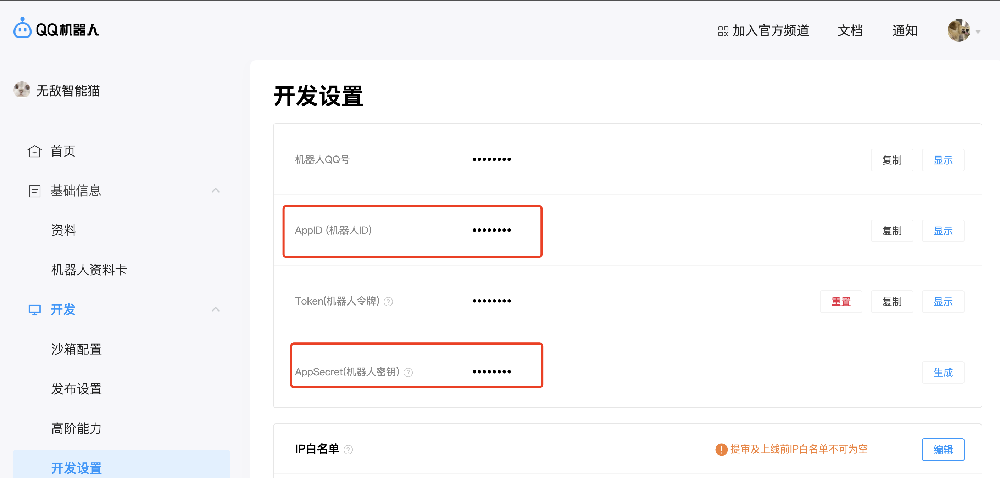

# qq-bot
一个高度定制化的QQ个人助理，目前个人开发者只能通过qq频道，与机器人私信的方式来使用。

# 安装
这里假设你使用conda管理python虚拟环境（python>3.8 建议==3.10）
```shell
conda create -n bot python=3.9
conda activate bot
pip install -r requirements.txt
```

## 配置机器人信息
注册并登录[qq开放平台](https://q.qq.com/)，按照提示创造自己的qq机器人。目前个人用户的机器人只能在频道内私信使用，不能将其作为好友单独聊天或者添加到群机器人。在机器人管理后台，查询到机器人的appid和secert。


将`config_template.yaml`复制并改名为`config.yaml`，填写查询到的appid和secert。
```yml
## 填写机器人信息
appid: "12121212"
secret: "xxxxxxxx"
```


# 如何使用
推荐在tmux下使用
```shell
python  bot.py
```


