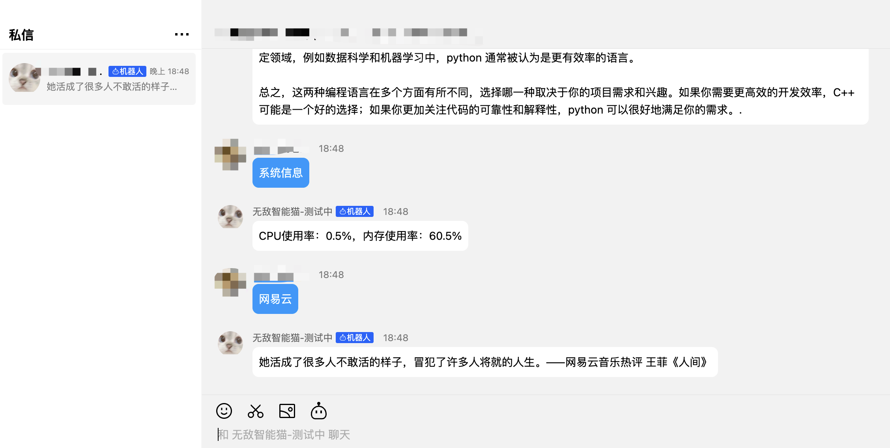

# QQ-Bot
一个高度定制化的QQ个人助理，目前个人开发者只能通过qq频道，与机器人私信的方式来使用。
你需要一台具有`公网ip`的轻量化服务器，主要用于填写qq机器人的IP白名单，以及做反向代理（我使用的阿里云最低配置的ECS，2核CPU+2GB内存）。


# 安装
**以下命令在轻量化服务器中执行。**
这里假设你使用conda管理python虚拟环境
```shell
conda create -n bot python=3.9
conda activate bot
pip install -r requirements.txt
```

## 配置机器人信息
注册并登录[qq开放平台](https://q.qq.com/)，按照提示创造自己的qq机器人，并注意将你轻量化服务器的公网ip填写到白名单中。在机器人管理后台，查询到机器人的appid和secert。
目前个人开发者的机器人只能在频道内私信使用，不能将其作为好友单独聊天或者添加到群机器人。


将`config_template.yaml`复制并改名为`config.yaml`，填写查询到的appid和secert。
```yml
## 填写机器人信息
appid: "12121212"
secret: "xxxxxxxx"
chat_host: "http://localhost:9999"   #修改合适的端口，注意轻量化服务器该端口应当开启。
model_name: "llama2-chinese"  # 该模型需要已在ollama服务器上运行
wait_time: 60  # 如果超过60秒没有收到ollama响应，就放弃此次请求
```

## 配置ollama
为了能够使用大语言模型的功能，需要使用ollama来生成对话server。
你需要一台至少4GB显存的linux服务器，该服务器不需要公网IP。
**以下操作均在这台高性能服务器上进行，而非轻量化服务器上。**

#### 1. 安装ollama

如果你拥有管理员权限,使用如下命令会自动下载ollama，并自动设置为启动服务。
```shell
curl -fsSL https://ollama.com/install.sh | sh
```
如果你没有管理员权限，或只想给自己使用，使用如下命令手动下载安装ollama。
```shell
mkdir -p ~/ollama/bin
cd ~/ollama/bin
## 下载ollama可执行文件
wget https://ollama.com/download/ollama-linux-amd64
mv ollama-linux-amd64 ollama

## 添加ollama到环境变量
echo 'export PATH=$PATH:~/ollama/bin' >> ~/.bashrc
source ~/.bashrc
```
#### 2.运行ollama-server
对于手动下载安装的ollama，在tmux中开启服务ollama-server。
```shell
tmux new -s ollama-server
# 在tmux会话内，启动ollama-serve
ollama serve
# 按Ctrl+b然后按d来从会话中分离，保证ollama-server在后台运行，可以使用 tmux a -t ollama-server重新进入会话。
```
#### 3.拉取llama2-chinese
```shell
ollama pull llama2-chinese
# (可选)在终端运行模型，测试效果（只需运行ollama serve即可，以下命令仅供测试）
ollama pull llama2-chinese
```
更多关于模型下载，模型删除等操作，参阅[ollama](https://github.com/ollama/ollama)
#### 4. 开启ssh代理隧道
以下命令能够将轻量化服务器的9999端口映射到高性能服务器的11434端口。注意端口号9999应该与config.yaml中的端口一致。
```shell
# ollama运行的默认端口为11434，无需修改。
# 端口号9999应与config.yaml中的端口一致。
# user_name与host为轻量化服务器的用户和ip
ssh -fN -R 9999:localhost:11434 -o ServerAliveInterval=60 -o ServerAliveCountMax=3  user_name@xxx.xxx.xxx.xxx
```


# 如何使用
**以下命令在轻量化服务器中执行。**
推荐在tmux下使用
```shell
python  bot.py
```
在qq频道私信对话界面输入`帮助`,可以获得机器人当前的功能。
快把你的机器人加入qq频道，并且与它私信吧！


